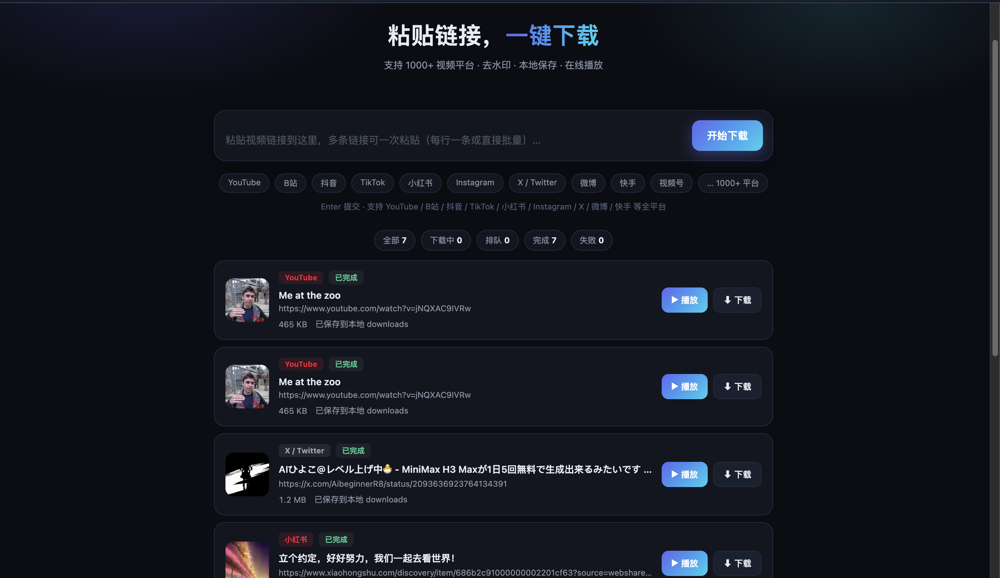
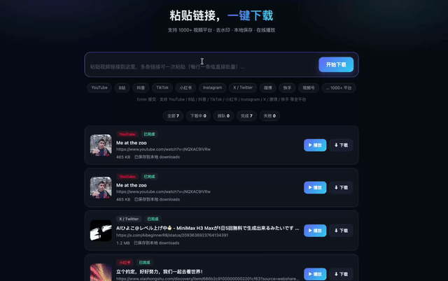

# RuiC-VideoGrab · 万能视频下载站

网页版全平台视频下载器：中间一个输入框，粘贴链接，一键下载。

**本地运行 · 本地保存 · 去水印 · 系统播放器打开 · 自选保存路径**

<div align="center">


</div>

## 📸 项目展示

<div align="center">
  
  <br>
  <sub>界面截图：中间输入框 + 实时进度 + 下载历史</sub>
  <br><br>
  
  <br>
  <sub>使用演示（[原视频下载](assets/demo/demo.mp4)）</sub>
</div>

## ✨ 功能

- 🔗 **中间大输入框**：粘贴即下，支持多链接批量排队（每行一条，并发 2 个任务）
- 🌐 **1000+ 平台**：基于 [yt-dlp](https://github.com/yt-dlp/yt-dlp) 引擎，覆盖 YouTube / B站 / TikTok / Instagram / X(Twitter) / 微博 / 快手 等
- 🎵 **抖音专用引擎**：Playwright 真浏览器过风控，**无需登录 cookie**，无水印下载（图集自动打 zip）
- 🍠 **小红书专用适配器**：支持带 xsec_token 的分享链接，视频/图集（自动打包 zip）均支持
- 🛡️ **B站风控自举**：自动申请 buvid3/buvid4 绕过 412 风控，412 间歇发作自动重试
- 📊 **实时进度**：百分比 / 速度 / 剩余时间；下载历史持久化，重启不丢
- ▶️ **播放走系统播放器**：点「播放」直接用你电脑默认播放器打开文件
- 💾 **下载自选路径**：点「下载」弹系统另存为对话框，想存哪存哪
- 🍪 **Cookies 配置**：网页设置里粘贴 Netscape 格式 cookie，解锁高清/需登录内容
- 🔒 **本地优先**：不注册账号、数据不出本机，下载历史只存在你的电脑上

## 🌍 支持平台

| 分类 | 平台 | 引擎 |
|------|------|------|
| 长视频 | YouTube、B站、西瓜视频… | yt-dlp（B站叠加风控自举） |
| 短视频 | 抖音、TikTok、快手、微博… | 抖音走 Playwright 专用引擎，其余 yt-dlp |
| 社交图文 | 小红书、Instagram、X(Twitter)… | 小红书专用适配器，其余 yt-dlp |
| 其他 | 音乐、播客、直播回放… 1000+ 站点 | yt-dlp 通用引擎 |

> 抖音 / 小红书 / B站 是三个「最难啃」的平台，本项目分别做了专用适配（见下方架构），其余平台由 yt-dlp 引擎统一覆盖。

## 🚀 快速开始

### macOS / Linux

```bash
./run.sh
# 打开 http://127.0.0.1:8900
```

### Windows

双击 **`run.bat`**（或 PowerShell 运行 `.\run.bat`），自动打开 http://127.0.0.1:8900。

首次运行自动：创建 venv → 安装依赖 → 安装无头 Chromium（抖音下载用，约 95MB）。

**环境要求**：Python 3.10+。建议安装 [ffmpeg](https://ffmpeg.org/download.html)（音视频合并用）：

```powershell
# Windows 推荐用 winget 安装 ffmpeg
winget install Gyan.FFmpeg
```

macOS：`brew install ffmpeg`（多数 Mac 已自带）。

### 手动方式（全平台）

```bash
python3 -m venv .venv          # Windows: py -3 -m venv .venv
.venv/bin/pip install -r requirements.txt        # Windows: .venv\Scripts\pip
.venv/bin/playwright install chromium            # 抖音下载依赖
.venv/bin/uvicorn backend.main:app --host 127.0.0.1 --port 8900
```

## 🧭 使用指南

1. **粘贴链接**：把视频链接粘进中间输入框（多个链接每行一个，回车即排队）
2. **等待下载**：进度条实时显示百分比 / 速度 / 剩余时间
3. **查看结果**：完成后出现在下载历史里，**重启网页历史仍在**
4. **播放**：点「播放」调用系统默认播放器
5. **另存**：点「下载」弹系统对话框，选你想要的保存路径
6. **（可选）登录**：需要高清/粉丝可见内容时，到右上角 ⚙ 设置粘贴 Cookies

## 🍪 配置登录 Cookies（可选）

抖音、B站、YouTube 已实现免登录下载；小红书多数笔记免登录可下。以下场景需要登录 cookie：小红书仅粉丝可见笔记、X/Instagram 高清、YouTube 年龄限制内容：

1. 浏览器安装 **Cookie-Editor** 类插件
2. 登录目标平台
3. 导出 **Netscape 格式** cookie
4. 打开页面右上角 ⚙ 设置 → 粘贴 → 保存（多个平台可合并粘贴）

## 🏗️ 架构

```
frontend/index.html     单页 UI（无构建，原生 JS）
backend/
  main.py               FastAPI 薄路由层
  engine.py             深模块：Engine 接口 + YtDlpEngine / XhsEngine 适配器
  douyin.py             DouyinEngine：Playwright 真浏览器 + aweme_detail 提取
  tasks.py              TaskManager：队列 / 并发 / 持久化
  platforms.py          平台识别纯函数
  bilibili.py           B站风控自举（buvid cookie）
downloads/              下载产物（每个任务一个目录）
data/                   history.json + cookies.txt + 自举缓存
```

### 多引擎路由

| 平台 | 引擎 | 关键机制 |
|------|------|---------|
| 抖音 | DouyinEngine（Playwright） | 真浏览器监听 `aweme_detail` 接口拿无水印直链，过风控免 cookie；图集自动打包 zip |
| 小红书 | XhsEngine 适配器 | 解析带 `xsec_token` 的分享链接，容错非标准 JSON；视频/图集均支持 |
| B站 | YtDlpEngine + 自举 | 自动申请 `buvid3/buvid4` cookie 绕过 412 风控，发作时自动重试 |
| 其余 1000+ 站 | YtDlpEngine | yt-dlp 通用提取，合并竞态可自恢复 |

设计要点：所有引擎实现同一 `Engine` 接口，任务管理器只面向接口调度，新增平台适配器无需改动队列与路由。

## 🧪 测试

```bash
.venv/bin/python -m pytest tests/ -q
```

75 个测试覆盖：平台识别、任务队列/并发/状态流转、引擎路由、B站自举、412 重试、合并竞态恢复、成品路径选择、抖音提取纯函数、小红书 xsec_token/非标准 JSON 解析、系统打开（macOS/Windows/Linux 三平台）与路径安全。

## ❓ 常见问题

<details>
<summary>需要登录账号吗？</summary>

不需要。抖音、B站、YouTube 已实现免登录下载，小红书多数笔记也免登录。仅「粉丝可见」等特殊内容需要粘贴 cookie。
</details>

<details>
<summary>为什么首次运行要下载 Chromium（约 95MB）？</summary>

抖音引擎用 Playwright 驱动真实浏览器，模拟正常用户访问以通过风控——这是「无水印 + 免登录」的代价，只需下载一次。
</details>

<details>
<summary>B站下载报 412 是什么？</summary>

B站的风控状态码。本项目会自动申请 buvid cookie 自举并间歇重试，一般无需人工干预。
</details>

<details>
<summary>下载的视频在哪？没声音怎么办？</summary>

产物在 `downloads/<任务>/` 目录。音视频分离的平台需要 ffmpeg 合并，未安装 ffmpeg 时可能只有画面或只有声音。
</details>

<details>
<summary>图集（多图笔记）怎么处理？</summary>

抖音、小红书的图集会自动打包成一个 zip，方便整体保存。
</details>

<details>
<summary>支持批量下载吗？并发多大？</summary>

输入框里每行一个链接即可排队，并发固定 2 个任务，其余自动排队。
</details>

<details>
<summary>我的数据会上传吗？</summary>

不会。全部本地运行，下载历史（`data/history.json`）和 cookie 都只存在你的电脑上。
</details>

## 🗺️ Roadmap

欢迎提 Issue / PR 一起完善：

- [ ] 字幕与封面一并下载
- [ ] 播放列表 / 合集批量抓取
- [ ] 移动端响应式适配
- [ ] Docker 一键部署
- [ ] 更多平台的专用适配器

## ⚠️ 声明

下载内容仅供个人学习研究使用，请遵守各平台服务条款与版权规定，勿用于商业用途或二次分发。

## 赞赏支持

如果这个项目帮到了你，欢迎请我喝杯咖啡 ☕

<div align="center">
  
  <br>
  <sub>微信扫码赞赏</sub>
</div>
